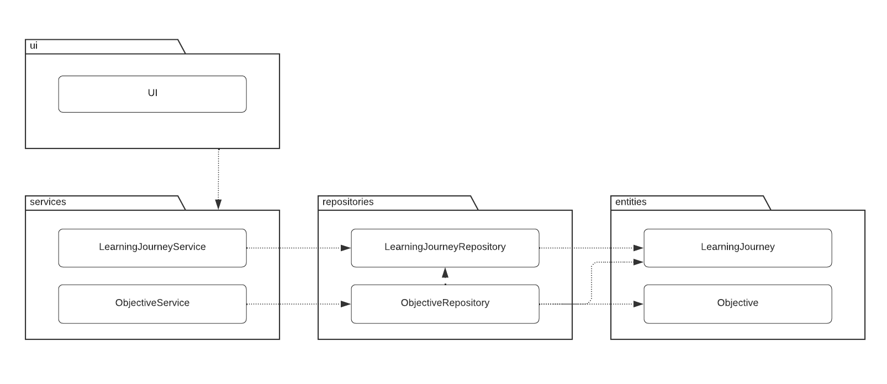
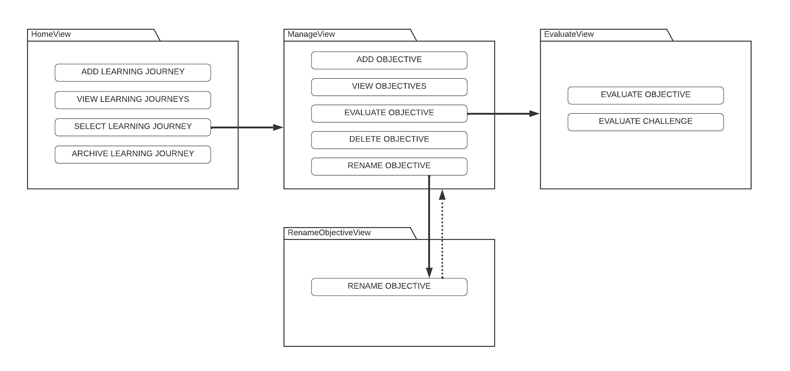
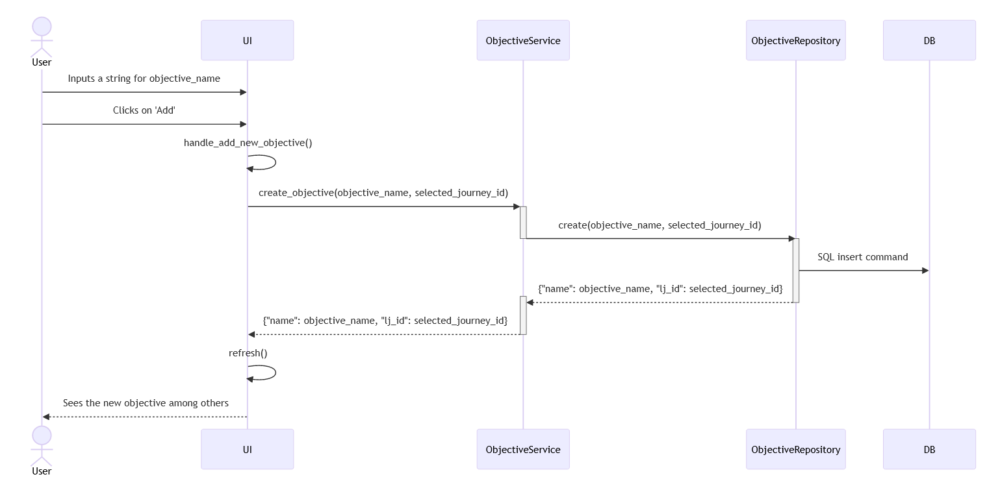

# Architecture description on a high level

The following package diagram (Figure 1) provides a general idea of the architecture of the Personal Learning Objective Manager application. As seen in the diagram, the application utilizes a layered architecture that spans from the UI class all the way to the database, that deals with data related to Learning Journey and Objective entities. In the middle, the service classes respond to service requests from the UI, whereas the repository classes execute the requests.

The model is not set in stone, but currently no changes to the big picture are foreseen.

Some redundancy has been noted between rivaling classes, such as LearningJourneyRepository and ObjectiveRepository. However, at this time, the degree of redundancy is ignorable, especially compared to the model's benefit of readability and a clear separation of concerns. Another clear benefit of using layered architecture in this project is how it will eventually enable a swift replacement of Tkinter with a more developer-friendly and user-friendly tool - little to no changes to the lower levels will be needed.

#### (Figure 1) Package Diagram describing the program's architecture on a high level

## UI architecture

Figure 2 demonstrates the View-based architecture used in Personal Learning Objective Manager. The View classes pack the features that are available to the user in each view (e.g. the user can't embark on a new Learning Journey in the HomeView, but not in the middle of renaming a Learning Objective, that'd be silly!)

In its current state, the application does not yet provide the features mentioned in the EvaluateView, but these will be implemented in Sprint 5. In the not-too-near-but-not-too-distant-either future, RenameObjectiveView might be used to rename both learning objectives as well as Learning Journeys.

#### (Figure 2) Package Diagram describing the View-based User Interface

## An example: what happens under the hood when a new Learning Objective is added

The following figure (Figure 3) is a simple depiction of how responsibilities are separeted in the layered architecture model used.

#### (Figure 3) Sequence Diagram of when the user adds a new Learning Objective

