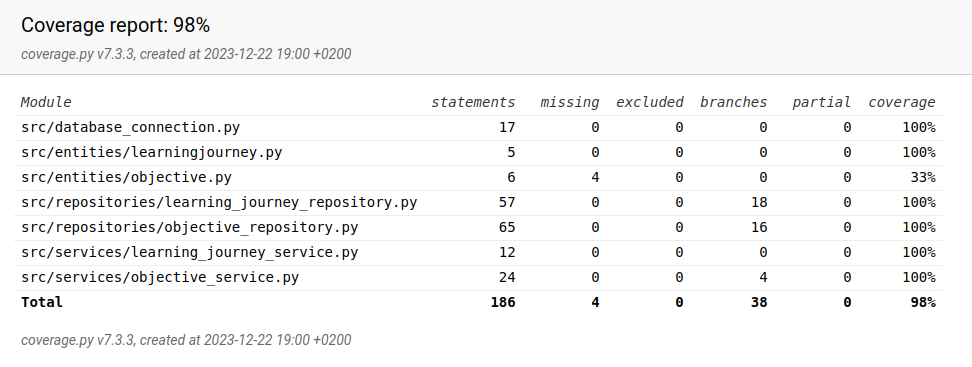

# Testing Document

The Personal Learning Objective Manager has been tested regularly during development with automated unit and integration tests as well as manually performed system tests - automating system tests was not considered necessary given the project's limited scope.

## Unit tests / Integration tests

The following test classes were implemented:

- TestLearningJourneyService
- TestObjectiveService
- TestLearningJourneyRepository
- TestObjectiveRepository

As their names suggest, they test either integration on the service level, or database handling methods on the repository level.

All test classes utilize dedicated instances of LearningJourneyRepository and ObjectiveRepository which, in turn, use a separate test database connection. This approach was used to encourage writing tests as easy as possible.

Figure 1 reports the latest test coverage. Database initialization is omitted.

#### (Figure 1) Coverage report

## System tests

### Installation

### Functionalities
