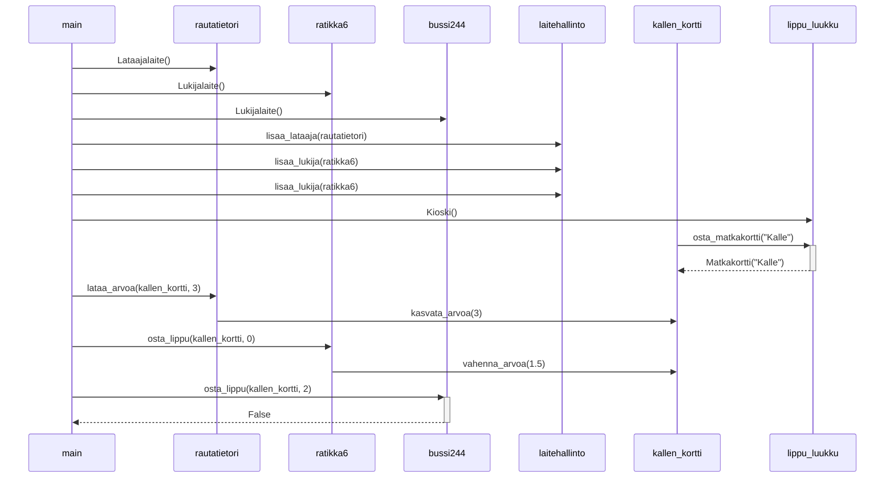

```mermaid
sequenceDiagram
    participant main
    participant rautatietori
    participant ratikka6
    participant bussi244
    participant laitehallinto
    participant kallen_kortti
    participant lippu_luukku

    main->>rautatietori: Lataajalaite()
    main->>ratikka6: Lukijalaite()
    main->>bussi244: Lukijalaite()
    main->>laitehallinto: lisaa_lataaja(rautatietori)
    main->>laitehallinto: lisaa_lukija(ratikka6)
    main->>laitehallinto: lisaa_lukija(ratikka6)
    main->>lippu_luukku: Kioski()
    kallen_kortti->>+lippu_luukku: osta_matkakortti("Kalle")
    lippu_luukku-->>-kallen_kortti: Matkakortti("Kalle")
    main->>rautatietori: lataa_arvoa(kallen_kortti, 3)
    rautatietori->>kallen_kortti: kasvata_arvoa(3)
    main->>ratikka6: osta_lippu(kallen_kortti, 0)
    ratikka6->>kallen_kortti: vahenna_arvoa(1.5)
    main->>+bussi244: osta_lippu(kallen_kortti, 2)
    bussi244-->>-main: False
```